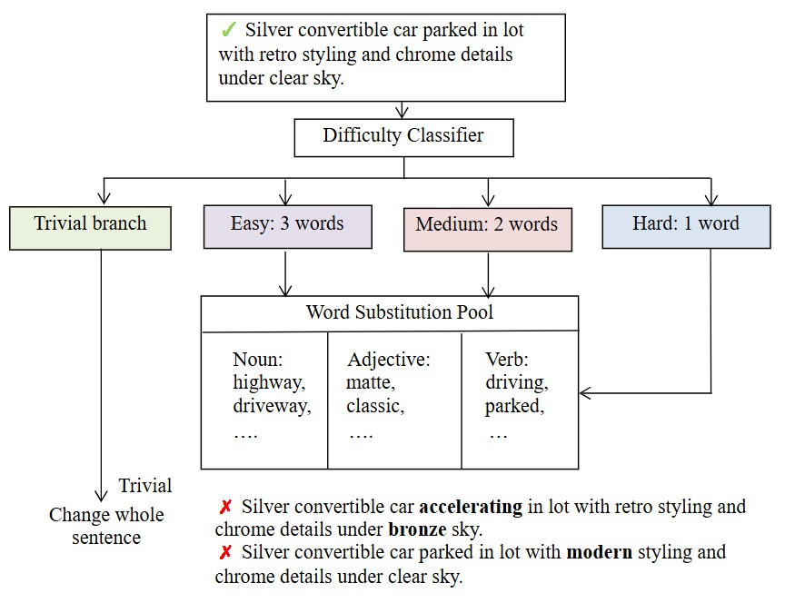
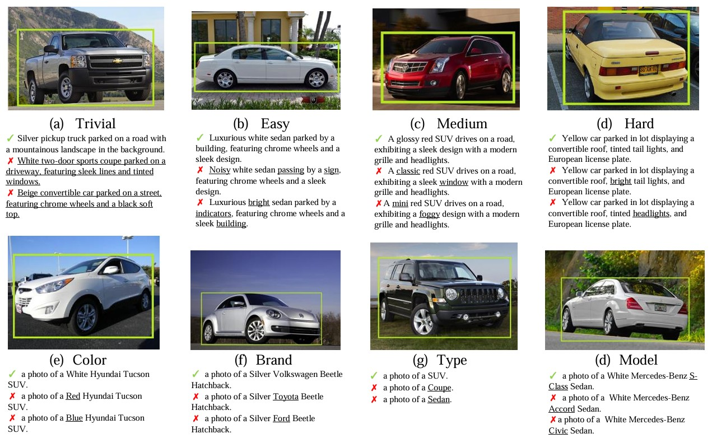

# 🚗 FG-OVVD: Fine-Grained Open-Vocabulary Vehicle Detection

This project focuses on fine-grained vehicle image understanding by constructing a dataset containing **semantically perturbed** and **attribute-altered** textual descriptions. It is designed to analyze how Open-Vocabulary Detection (OVD) models behave under various semantic shifts and granular attribute modifications.

We divide the negative caption design into two main categories:

- **Difficulty-based**: Captions with word-level perturbations that introduce varying degrees of semantic confusion.
- **Attribute-based**: Captions with isolated attribute errors (e.g., color, model, brand) to evaluate sensitivity to fine-grained object features.

We also analyze **Top-k accuracy** and **confidence thresholds** to examine the model's robustness and prediction consistency under subtle language variations.

---

## 🧩 Dataset Categories

### 1️⃣ Difficulty-based Captions

Negative captions are generated by randomly replacing words in the original sentence using part-of-speech–grouped vocabulary pools. Four difficulty levels are defined:

- **Trivial**: Completely unrelated captions (sourced from other images)
- **Easy**: Three random word replacements
- **Middle**: Two random word replacements
- **Hard**: Only one word replaced — the most challenging due to high semantic similarity

📌 Architecture Diagram:

  
📁 Dataset and code: [`difficulty_based/`](./difficulty_based/)

---

### 2️⃣ Attribute-based Captions

Attribute-based errors are crafted based on structured properties extracted from the image. Two types of positive captions and their corresponding negative counterparts are constructed:

- **Category 1: Color + Full Model Name (including brand)**
  - Wrong color
  - Wrong brand
  - Wrong model name

- **Category 2: Vehicle Type (e.g., SUV, Sedan)**
  - Wrong vehicle category

📌 Architecture Diagram:

  
📁 Dataset: [`attribute_based/`](./attribute_based/)

---

## 📂 Folder Structure Overview

